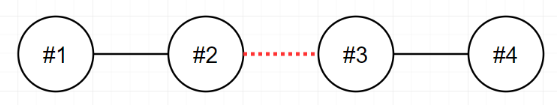
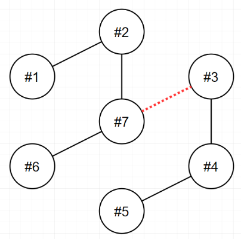
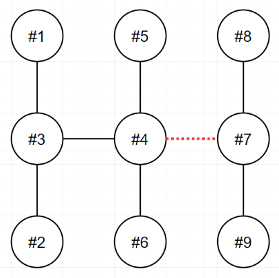

# Lv. 2 전력망 둘로 나누기

## 문제 설명

n개의 송전탑이 전선을 통해 하나의 **트리(Tree)** 형태로 연결되어 있습니다.

당신은 이 전선들 중 **하나를 끊어** 현재의 전력망 네트워크를 **2개로 분할**하려고 합니다.

이때, 두 전력망이 갖게 되는 송전탑의 개수를 최대한 비슷하게 맞추고자 합니다.

송전탑의 개수 `n`, 그리고 전선 정보 `wires`가 매개변수로 주어집니다.

전선들 중 하나를 끊어 두 개의 전력망으로 나누었을 때, 두 전력망이 가지는 송전탑 개수의 차이(절댓값)를 `return` 하도록 `solution` 함수를 완성해주세요.

---

## 제한사항

- `n`은 **2 이상 100 이하**인 자연수입니다.
- `wires`는 길이가 **n - 1**인 정수형 2차원 배열입니다.
  - `wires`의 각 원소는 `[v1, v2]` 형태입니다.
  - 이는 전력망의 `v1`번 송전탑과 `v2`번 송전탑이 전선으로 연결되어 있음을 의미합니다.
  - `1 ≤ v1 < v2 ≤ n`입니다.
  - 전력망 네트워크가 하나의 **트리(Tree)** 형태가 아닌 경우는 입력으로 주어지지 않습니다.

---

## 입출력 예

| n | wires | result |
|--:|--------|-------:|
| 9 | `[[1,3],[2,3],[3,4],[4,5],[4,6],[4,7],[7,8],[7,9]]` | 3 |
| 4 | `[[1,2],[2,3],[3,4]]` | 0 |
| 7 | `[[1,2],[2,7],[3,7],[3,4],[4,5],[6,7]]` | 1 |

---

## 입출력 예 설명

### 입출력 예 #1

다음 그림은 주어진 입력을 해석한 방법 중 하나를 나타낸 것입니다.

- `4`번과 `7`번을 연결하는 전선을 끊으면 두 전력망은 각각 **6개**와 **3개**의 송전탑을 가지게 됩니다.
- 이보다 더 비슷한 개수로 전력망을 나눌 수는 없습니다.
- 또한 `3`번과 `4`번을 연결하는 전선을 끊어도 최선의 정답을 도출할 수 있습니다.

---

### 입출력 예 #2

다음 그림은 주어진 입력을 해석한 방법을 나타낸 것입니다.

- `2`번과 `3`번을 연결하는 전선을 끊으면 두 전력망은 모두 **2개의 송전탑**을 가지게 됩니다.
- 이 방법이 최선입니다.

---

### 입출력 예 #3

다음 그림은 주어진 입력을 해석한 방법을 나타낸 것입니다.

- `3`번과 `7`번을 연결하는 전선을 끊으면 두 전력망은 각각 **4개**와 **3개**의 송전탑을 가지게 됩니다.
- 이 방법이 최선입니다.